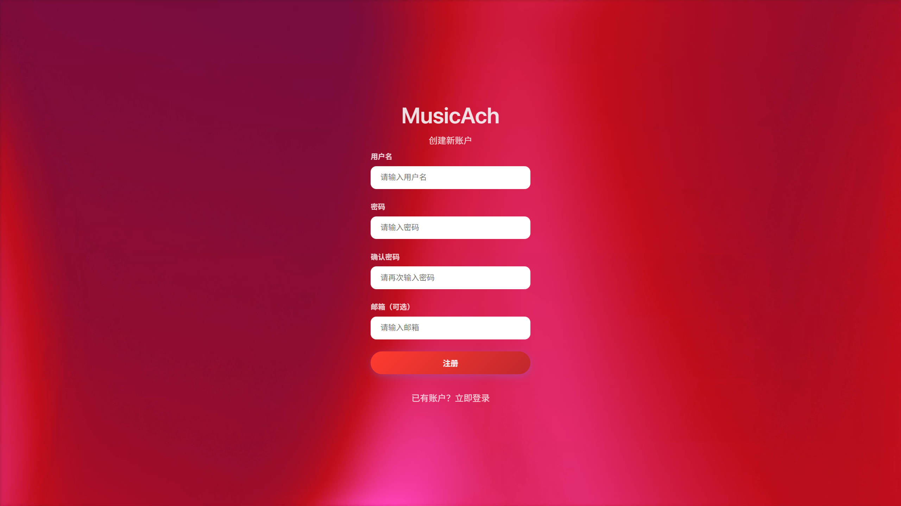

# MusicAch 音乐管理系统

<div align="center"
>
  <h1>MusicAch</h1>
  <p>基于 ASP.NET 4.7.2 的个人音乐收藏管理系统</p>
  <p>
    
    
    
  </p>
</div>

## 📖 项目简介

MusicAch 
### ✨ 核心

asp.net web开发作业

## 🛠️ 技术栈

### 后端
- **框架**: ASP.NET 4.7.2 (C#)
- **数据库**: MySQL 8.0
- **会话管理**: ASP.NET Session

### 前端
- **HTML5** - 语义化标签
- **CSS3** - 动画、毛玻璃效果、响应式布局
- **JavaScript** - 原生JS实现交互功能
- **视觉效果** - Video背景、Backdrop-filter

## 💻 系统要求

- **开发环境**: Visual Studio 2019+ 或 JetBrains Rider
- **运行环境**: IIS 7.0+ 或 IIS Express
- **.NET Framework**: 4.7.2 或更高版本
- **数据库**: MySQL 5.7+ (推荐 8.0)
- **浏览器**: Chrome/Firefox/Safari/Edge (最新版本)

## 🚀 快速开始

### 1. 克隆项目
```bash
git clone https://github.com/achieveil/MusicAch.git
cd MusicAch
```

### 2. 数据库配置

在 MySQL 中执行数据库脚本：

```sql
-- 创建数据库
CREATE DATABASE IF NOT EXISTS MusicAch DEFAULT CHARACTER SET utf8mb4 COLLATE utf8mb4_unicode_ci;

USE MusicAch;

-- 执行项目中的 database.sql 文件
```

### 3. 修改配置文件

编辑 `Web.config` 中的数据库连接字符串：

```xml
<connectionStrings>
    <add name="MusicAchDB"
         connectionString="Server=localhost;Database=MusicAch;Uid=root;Pwd=yourpassword;charset=utf8mb4;"
         providerName="MySql.Data.MySqlClient"/>
</connectionStrings>
```

### 4. 运行项目

1. 使用 Visual Studio 打开解决方案文件 `MusicAch.sln`
2. 按 `F5` 运行项目
3. 浏览器将自动打开并导航到登录页面

## 🖼️ 界面预览




### 登录界面
- 动态视频背景
- 流畅切换动画
- 简洁的表单设计

### 音乐库主页
- 卡片式音乐展示
- 悬停显示播放按钮
- 响应式网格布局

### 音乐播放器
- 模态窗口设计
- 网易云原生控件
- 非侵入式体验

## 📚 使用指南

### 注册新用户
1. 点击登录页面的"立即注册"
2. 填写用户名、密码（邮箱可选）
3. 点击注册按钮

### 添加音乐
1. 登录后点击"添加音乐"按钮
2. 填写音乐信息：
    - **标题**: 音乐名称（必填）
    - **链接**: 网易云音乐链接（必填）
    - **封面**: 封面图片URL（选填）

#### 示例音乐信息
```
标题：起风了
链接：https://music.163.com/#/song?id=1330348068
封面：http://p1.music.126.net/diGAyEmpymX8G7JcnElncQ==/109951163699673355.jpg
```

### 管理音乐
- **播放**: 点击音乐卡片上的播放按钮
- **编辑**: 点击三点菜单选择"编辑"
- **删除**: 点击三点菜单选择"删除"
- **搜索**: 使用顶部搜索框快速查找

## 📁 项目结构

```
MusicAch/     
├── App_Data/           # 应用程序数据           
├── Content/            # 静态资源
│   ├── css/            # 样式文件
│   ├── js/            # JavaScript文件
│   ├── images/        # 图片资源
│   └── videos/        # 视频背景
├── Database/           # 数据库脚本
├── Pages/              # ASPX页面
│   ├── Login.aspx     # 登录页面
│   ├── Register.aspx  # 注册页面
│   ├── Default.aspx   # 主页
│   ├── AddMusic.aspx  # 添加音乐
│   ├── EditMusic.aspx # 编辑音乐
│   ├── About.aspx     # 关于页面
│   └── Logout.aspx    # 
├── Web.config          # 配置文件
└── README.md          # 项目文档
```


## ⚠️ 注意事项

### 网易云音乐播放限制

由于版权保护，部分音乐可能无法播放：

- **版权限制**: 某些歌曲因版权问题不允许外部播放
- **地区限制**: 部分音乐仅在特定地区可用
- **登录要求**: 某些歌曲需要登录网易云账户

> 💡 建议添加可以正常外链播放的音乐，或使用网易云官方API进行授权


---

<div align="center">
  <p>Made  by achieveil</p>
  <p>如果觉得不错，请给个 ⭐ Star 支持一下</p>
</div>